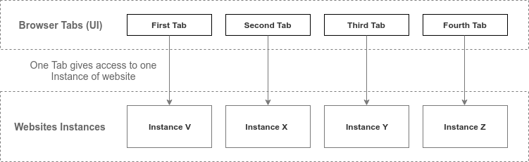
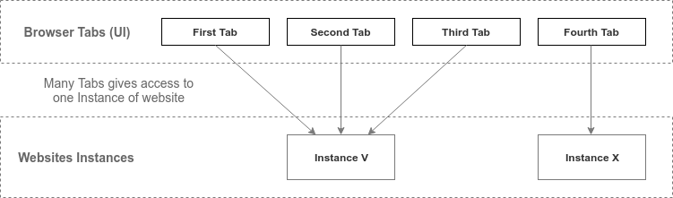

# Tabs API or Website Context API - kontrola wielu kart przez jedną instancję strony internetowej

[ dokument niegotowy ]

## Wstęp

Proponowane API Kart jest w dużym stopniu analogiczne i uzupełniające dla History API oraz propozycję API zwaną Portals.  
Tabs API rozszerzy funkcje zawarte w History API na karty tego samego pochodzenia(SOP) co umożliwi zintegrowaną kontrolę nad nimi, zmniejszenie objętości stron i doskonałą synchronizację między kartami.  
Tak jak History API może przejąć przyciski wstecz/do przodu przeglądarki. Tabs API może przejść karty przeglądarki.  
Nowe API jest proste w implementacji i nie komplikuje życia użytkownika.

Single Page Application - Single Page - many tabs. - porównać do SPA - Tabs API to jest rozszerzenie SPA!


Rozszerzenie idei History API i Single Page App

Tak jak w History APi ma pushState tworzący nowy stan "za" aktualnym stanem, tak w Tabs API newParallelState/newState/newContext tworzący równoległy stan (Parallel state) w formie nowej karty. 

Karta to alternatywny widok tej samej strony...


## Cele

Przy wielu otwartych kartach tego samego pochodzenia:

* Strona internetowa zajmować będzie mniej miejsca.
* Strona internetowa będzie miała mniejsze zużycie procesora.
* Strona internetowa będzie szybciej się pobierała i zużywała mniej transferu Intenetu.
* Strona internetowa będzie się znacznie szybciej uruchamiała.
* Sprawniejsze przełączanie między kartami.
* Doskonała synchronizacja stałych elementów strony, jak np. czat, powiadomienia na Facebooku.
* Lepsze zarządzanie stroną dla developera (brak potrzeby obsługi nietypowych sytuacji, np. nadpisywania stanów tych samych elementów)
* łatwiejszy dostęp do informacji dla developera, o sposobie używania strony przez użytkownika, zachowanie ciągłości używania strony
* Czasami strona działa prawidłowo tylko pod jedną postacią. Zdarza się, że strona otwarta w nowej karcie nie otwiera się, tylko zwraca informację że może działać tylko w jednej karcie (strona PKP). to API umożliwi, żeby w każdej nowej karcie mogła otwierać się dokładnie ta sama strona, nawet bez zmiany jakiegokolwiek elementu na niej. Ewentualnie można dodać API przechwytujące nową stronę i nie otwierajacą jej, tylko wracającą do już otwartej - istnieje już takie coś? Dla rozszerzeń chyba istnieje.


## Nazewnictwo

* Browser tab - karta przeglądarki internetowej, element UI.
* Inside Tab - karta (element UI przeglądarki) kontrolowana przez instancję stony internetowej.
* Website instance -  pojedyncze wystąpienie niezależnego kodu zgodnego z danym wzorcem. Instancja strony internetowej (kodu HTML, CSS, JS etc.), czyli niezależnych bytów danej strony internetowej, zajmującej określone miejsce w pamięci, uruchomionej w przeglądarce internetowej.
* Instance snapshot - stan strony internetowej w danym kontekście
* Website (Browser) Context - kontekst przeglądarki w jakiej "jest" strona internetowa. Kontekstem może być Tab, WebExtensions Popup, Sidebar, IFrame, Window. Pojęcie ogólniejsze od Inside Tab.


## History API

Przypomnę jak działa Hostory API:
[](https://html5demos.com/history/)
[](https://demos.mattwest.io/history-api/index.html)

Na tej stronie po kliknięciu w link zmienia się  

W History APi zmienia się link, tytuł i stan historii, ale strona się nie zmienia, nie odświeża (zasada Single Page App). Jedyna zmiana jest wynika callbackiem wywołanym za pomocą event-u `popstate`. I tak można sobie w tym even-cie podmienić treść elementu DOM #content czy #title na inną. Strona zmienia treść bez odświeżania się,

To jest to samo API, które wykorzystuje [React Router](https://www.nafrontendzie.pl/react-router-wersji-4-wszystko-nowa) w wygodniejszej dla niektórych formie (piszę, jeśli ktoś korzysta z React Router a nie korzystał bezpośrednio z Histry API), gdzie podmienia się komponent.


## Stan obecny

Aktualnie jedna karta przeglądarki internetowej jest powiązana z jedną instancją strony internetowej:



Bardziej obrazowo:


Przy czym np. V, X i Y mogą być instancjami tej samej strony, tylko np. innej podstrony.

Klikniecie Browser Tab powoduje załadowanie strony i wyświetlenie jej do widoku przeglądarki.

### Przykład stanu obecnego

Trzy karty zawierajace różne podstrony Facebooka. Trzy filmy z YouTube otwarte w trzech osobnych kartach.


## Propozycja

Wiele kart może być powiązane z jedną instancją strony internetowej:



Bardziej obrazowo:


Kliknięcie Browser Tab powoduje załadowanie strony i wyświetlenie jej widoku oraz wywołanie `newcontext` event. Ale gdy otwarta już jest np. First Tab i użytkownik przejdzie do Second Tab to strona już się nie ładuje ani nie wyświetla od nowa(zostaje tak jak jest), a tylko wywołuje się `newcontext` event i przekazuje do callback-u informacje o kontekście.
 and transmit context to this Instance though event `newcontext`

To deweloper strony decyduje czy przechowywać treść wszystkich kart na raz w pamięci, czy oczyszczać pamięć i ładować dopiero po przejściu do danej karty. Jest to w pełni pod kontrolą dewelopera i może korzystać z dowolnych rozwiązań.  

Przełączanie między kartami zmienia tylko kontekst(adres, tytuł itp.) tej samej instancji strony oraz wywołuje event zwracający kontekst.

Przy przełączaniu między kartami z adresem tego samego pochodzenia strona zostaje ta sama, zmienia się tylko [końcówka adresu] i tytuł, tak jak przy Hostory API, gdy klika się przycisk Wstecz.

## API

### Event `newcontext/opencontext/startcontext`, `closecontext/endcontext` i `changecontext`

```javascript
navigator.addEventListener("newcontext", (event)=>{ // id do rozróżniania kontekstów lub adres i tytuł?
   // aktywuje się, gdy otworzy się nową kartę z adresem strony - np. poprzez kliknięcie linka kółkiem, menu kontekstowe i Otwórz link w nowej karcie/oknie
   
});
```

#### Event `newcontext` aktywuje się gdy

* user kliknie w link tego samego pochodzenia (linka klikniętego w tej samej ale też w innej domenie - instancja strony przejmuje każdy link), window.open(address)
* wywoła w każdy sposób nowe okno/kartę (w tym z poziomu paska adresu, paska zakładek, dodatku, z zewnętrznej aplikacji (być może ze względów bezpieczeństwa lepiej to zablokować ale w zasadzie i tak event to przejmuje wiec raczej nie powinno być porblemów, można odrzucić jakieś dziwne adresy))
* nie jestem przekonany czy powinien się aktywować gdy pierwszy raz otworzy się instancję strony (pierwszy kontekst tej instancji), czy stworzyć osobny event do tego, czy może nawet nie będzie potrzebny, bo po prostu można skorzystać z już istniejących event-ów.

Parametr context zawiera adres (czyli tylko(?) adres strony jest kontekstem). Chociaż zastanawiałem się czy można zezwolic na wiele kart z tym samym adresem w tym samym kontekście (wtedy dana karta z danym adresem musiałaby przejmować wszelkie próby otwarcie nowej karty z tym adresem, lub tworzyć wtedy nową instancję).
Parametr context zawiera też jakieś informacje o źródle otwartego adresu.

### Funkcja navigator.newContext(adres, tytuł, ~~callback?~~) do podmieniania linków, działająca identycznie ja "otwórz w nowej karcie" tylko zgodnie ze specyfiką Tabs API

~~Nie wiem czy konieczny jest ten callback, bo pokrywa się on z callbackiem dla event newcontext. Jedynie może być przydatny dla zachowania kontekstu wywołania. Jednak można to zrobić inaczej, np. zwracając dodatkowy parametr w callbacku dla event newcontext z przekazanym parametrem?.~~ Rezygnuję z parametru callback.
navigator.newContext(adres, tytuł, parametr);
i w parametrze callback event-u newcontext:
navigator.addEventListener("newcontext", ({adres, tytuł, parametr})=>{}
parametr to dowolny obiekt, liczba, string, tablica - any. gdy adres wywołany w inny sposób niż navigator.newContext to parametr zwraca null.
(!nie wiem jak nowe karty przekazują info o źródle kliknięcia w link, być może to też powinien zwracać callback) - np. czy karta została otwarta z wewnątrz strony tej domeny, obcej domeny(?), z interface przeglądarki(wpisanie adresu w pasek adresu, link z zewnętrznego programu, z zakładek).


### Stan navigator.activeContext

Właściwość `navigator.activeContext`/`.lastContext` zwraca aktualny obiekt z aktywnym kontekstem (kartą) - adres, tytuł i metodę zamykania tego konteksu (przełączania jest do zastanowienia, bo może być użyte do zapętlonego przełączania między kartami blokującego przeglądarkę, w sumie otwieranie też może to zrobić, dlatego navigator.openContext powinien podlegać ograniczeniom takim jak np. window.open).

### Tablica navigator.contextsList

Tablica `navigator.contextsList` zawierająca listę kontekstów dla strony tego samego pochodzenia.
każdy kontekst

## Zachowanie przeglądarki

* Gdy użytkownik użyje (standardowej w przeglądarkach) funkcji duplikacji strony, powinna zostać wymuszona osobna instancja strony. Wynika to z założenie że inaczej funkcja duplikacji nic by nie zrobiła, prócz tworzenia karty z tym samym kontekstem. Chociaż być może istnieją sytuacje gdzie dwie karty z tym samym kontekstem tej samej instancji będą potrzebne?
* Być może niektóre Event-y strony będą działać nietypowo, jak np. event wejścia i wyjścia stronę gdy przełącza się między kartami tej samej instancji. W takiej sytuacji event wyjścia ani wejścia nie powinien się uaktywniać. Być może będzie potrzeba powstania dodatkowych event-ów obsługujących przejście między kontekstami tej samej instancji strony (zaraz, przecież to ma być chyba podstawowa funkcja Tabs API?!). Notuję to, żeby zwrócić uwagę że w procesie dostosowania stron do Tabs APi będzie być może konieczne skorzystanie z obu rozwiązań.
* Zmiana stanu już wskazanej karty?? a może to history api wystarczy. replaceState. Jak się ma History API do Tabs API? - czy historia jest wspólna dla każdej karty? Raczej tak być nie powinno, czyli każdy kontekst musi mieć swoją historię.
* Odświeżanie strony - ciekawy temat, w zasadzie można się zastanowić, czy przycisku odśwież nie podłączyć również pod specjalny event do odświeżania tylko kontentu, zamiast zwyczajnie odświeżać całą stronę. A za pomocą hard restart dopiero odświeżać całą stronę, co jest jednoznaczne z odświeżeniem wszystkich kart tego samego pochodzenia. W obu wypadkach w interface przeglądarki powinno zawrzeć się informację o wspólności kart ze stroną tego samego pochodzenia. jeśli przycisk odświeżania ma działać w inny niż standardowy sposób, to powinien być odpowiednio oznaczony (jakiś znaczek na tym przycisku, który informuje o odświeżaniu tylko treści a nie całej strony).
  * opcja 1: odświeżanie wszystkich kart jednej instancji, ale z pytaniem/ostrzeżeniem, których kart dotyczy odświeżenie. 
  * opcja 2(wg mnie lepsza): załadowanie odświeżanej karty od nowa, i oderwanie jej od wspólnej instancji. ale również możliwość dodanie callback-a dla przeglądarkowej funkcji odświeżania karty (przy tym "hard reload", żeby wymusić odświeżenie strony i oderwanie od wspólnej instancji strony). 
* Każda karta i tak będzie miała własny stan historii, więc również będzie można cofnąć się do strony innego pochodzenia. Oznacza to płynność przełączania karty z trybu wspólnego dla jednego pochodzenia do innego. W rzeczywistości będą to inne karty tylko wyświetlone w tym samym miejscu, ale bez animacji zamykania i otwierania.
* Podgląd kart (miniaturki) - niedostępne, lub dostępny tylko snapshot ostatniego stanu. Raczej niemożliwy dynamiczny stan karty w tle.
* Nie da się wyświetlić dwóch kart obok siebie, więc wyjęcie takiej karty z okna jednej przeglądarki musi oznaczać zduplikowanie całej strony(klonowanie, bez ponownego ładowania) i oderwanie jej od wspólnej instancji (czyli oznacza to jedną instancję na jedno okno, nie licząc iframe itp, które też zawsze są osobną instancją).
* ikonki wyciszenia głośności - osobne dla każdej karty, ale działające jak jeden? (może ktoś powiedzieć że nie jest to zgodne z jego "wizją", ale takie rozwiązanie będzie po prostu działać). chociaż nie widzę przeszkód, żeby stworzyć osobny "kanał" dźwięku dla każdej karty ze wspólnej instancji strony, i jego kontrolować ikonką wyciszenia.

### Porównanie działania

[tabelka co się dzieje w starej metodzie a co w nowej, krok po kroku, przykłady]


### Przykład użycia propozycji

React Router
[kod]

Zdarza się, że otwiera się tą samą stronę w wielu kartach, te karty zajmują tyle co cała strona, ale różnice między kartami to np. tylko ten obrazek i kilka komentarzy pod nim. Więc realną korzyścią jest znaczne zmniejszenie obciążenia pamięci, ale też procesora, w sytuacjach otwierania wielu kart tej samej strony.


## Tabs API a History API i inne istniejące API - podobne lub analogiczne

| Tabs API | History API |
|:------:|:------:|
| `navigator.newContext` | `document.pushState` |
| lack | `replaceState` |
| event `newcontext` i `closecontext` | event `onload` i `unload`? (one będą odpalany gdy tworzy się pierwszą kartę tej instancji lub zamknie ostatnia kartę tej instancji, w tym gdy przejdzie się na stronę innego pochodzenia na tej samej karcie) |
| event `contextchange` | event `popstate`, event `visibilitychange`, (`pagehide`?), ale już event `blur`, `focus` nie jest analogiczny |
| `navigator.newContext` | `window.open` |
| `navigator.contextsList[n].isActive`? | `visibilityState` |
| click on other tab | `go`, `back`, `forward` |
| `windows.close()` (inaczej działające - tak jak `closeContext()`), `closeContext()` | `window.close()` |
| `navigator.activeContext` | `window.history.state` |

## Polyfill

Da się utworzyć prosty polyfill dla API kart, tworząc pasek kart wewnątrz strony. Jednak jest to rozwiązanie znacznie gorsze niż natywne Tabs API.

**Polyfill vs Native solution**:

|Polyfil | Native solution|
|:------:|:--------------:|
| Karty zajmują dodatkowe miejsce w pionie | Karty nie zajmują dodatkowego miejsca w pionie |
| Pasek kart zachowuje się nieprzewidywanie, to jest - tak jak go zaprojektują deweloperzy strony na której on się znajduje | Pasek kart zachowuje się zawsze tak samo, przewidywalnie, zgodnie z przyzwyczajeniem - tak jak zaprojektują to deweloperzy przeglądarek |
| Można otworzyć część kart w pasku przeglądarki a część w pasku Polyfill-a na stronie co może spowodować bałagan i utrudnić dostęp do części kart | Można otworzyć karty tylko w pasku przeglądarki, dzięki temu zachowany jest porządek i bezpośredni dostęp do kart |


## Animacja przesuwania div-a z kartami ze strony do postaci kart w przeglądarce

To ma być forma prezentacji.


## Wątpliwości

* konieczność dostosowania się do nowego API - nie ma takiej konieczności. można wymiennie i nawet jednocześnie z poziomu tej samej strony, wedle potrzeb, używać i standardowego rozwiązania i Tabs API. Dla użytkownika powinno to być w zasadzie niezauważalne (nie licząc braku korzyści z używania Tabs API) ani utrudniać procesu dewelopingu.
* Cache API jako optymalizacja ładowania strony? W porównaniu do Tabs API jest o wiele gorsze bo Tabs API nie musi przetwarzać ponownie całej strony. oraz spełnia częściowo inne funkcje.
* Message API do synchronizacji? Raczej nieporównywalnie gorsze i bardziej skomplikowane rozwiązanie.

* przeładowywanie skryptu przy przełączaniu kart, zamiast po prostu załadowanie już gotowej strony - może opóźnienia wystąpią, ale developer ma pełną kontorlę nad tym, może tego użyć optymalnie, może też tego API po prostu nie użyć, jeśli np. i tak cała strona musi się załadować od nowa i nie ma części wspólnych.
* jeśli jakaś strona tego potrzebuje, to niech po prostu zrobi własny pasek wewnątrz strony, do przełączania między kartami i tam kontroluje przełączanie między kartami - może tak być, ale jednak prawie każdą stronę można otwierać w nowej karcie i prawie nikt tego nie ogranicza, a optymalizacja z powodu tego API jest całkiem realna dla każdej strony, którą otwiera się w wielu kartach przeglądarki, nie tylko dla specjalnych stron typu aplikacja, która może posiadać wewnętrzny system kart. A jeśli użyć
* pomieszanie stron - to dotyczy też każdej strony, a jednak użytkownicy używają w ten sposób przeglądarki, więc brak tego API tego nie rozwiąże, a istnienie tego API rozwiąże inną kwestię (optymalizacji)
* to API nie rozwiązuje tych problemów, bo i tak musi istnieć wersje stron, które ładuję się jako osobna strona, jako wsparcie dla starszych przeglądarek oraz gdy użytkownik nie zezwoli na używanie InsideTabs. Faktycznie, i tak trzeba przygotować takie wersje strony, ale w jakimś stopniu to i tak pomaga, a poza tym, głównym celem jest mniejsza zajętość RAM-u i procesora, łatwiejsze uzyskanie optymalizacji.
* istnieje onMessage, które umożliwia przekazywanie pewnych rzeczy. Nadal nie jest to tak proste i wygodne jak InsideTabs.
* mimo obsługi Tabs API, konieczne i tak jest wsparcie dla przeglądarek z brakiem/wyłączoną obsługą itp. (sytuacja taka sama jak z History API)
* Jak obsłużyć zachowania "w tle"? Nie będzie zachowań w tle, wszystko będzie na tej samej instancji strony. Rzeczy w tle strony można odpalić np. w Worker-ze.
* renderowanie kontentu karty w tle, żeby był "w gotowości". prerender elementu? Jak? być może zarządzać tym jest w staniesama przeglądarka. 
* blokowanie kontentu przez kontent a wielowątkowość osobnych kart - jak to jest i czy w ogóle jest problemem?
* Tabs API a Page Visibility API
* zapamiętanie zmian użytkownika w treści, np w input-ach, zaznaczenie tekstu dowolnego elementu, stan scrollbara(te sameproblemy co z History API),
* Logowanie do wielu kont na wielu kartach, odświeżanie tylko jednej karty(jednego konta?), wylogowywanie - teoretycznie obsługa tego musi być po stronie dewelopera, ale właściwie to zaleta, bo bardziej się to kontroluje. elementy wspólne... też mogą być wymienne (np. pasek nawigacji na którym jest link do zalogowanego konta)
* renderowanie wielu wersji tego samego elementu, po to żeby móc wyświetlić dwie karty (konteksty) tej samej instancji strony jednocześnie? oraz żeby móc generować dynamiczny podgląd/miniaturę. Czyli: elementy wspólne - identyczne(klonowany widok tych elementów), elementy te same, ale w wielu wersjach (np. rozciągnięty przez dłuższą treść kontener), odrębne elementy (np. osobny obrazek dla osobnego kontekstu.). tym zarządzałaby przeglądarka, dla dewelopera byłoby to obojętne. W związku z tym byłoby wiele poważniejszych przeszkód(związanych np. z akcjami na stronie), więc raczej stworzenie tego jest nierealne (no chyba, ze tylko do podglądu).
* elementy które są te same na każdej karcie, czasami też mogą mieć odmienny stan, np. wpisany tekst w formularzu, rozwinięte menu główne - one powinny być też zapamiętane i zmieniające się po przełączeniu z karty na kartę (jeśli deweloper uzna, że tak powinno być). to jest pewna dodatkowa praca. bo inaczej użytkownik mógłby być zdziwiony(?), że rzecz którą zrobił w jednej karcie, jest widoczna w innej - to zdziwienie wynikałoby z przyzwyczajenia, że każda karta jest osobnym bytem, i to przyzwyczajenie (w tym wypadku - złudzenie), być może, dobrze byłoby podtrzymać.
* ~~lepsza integracja z History API, żeby móc zrobić, żeby istniejące już implementacje Hostory API automatycznie, tylko aktualizacją przeglądarki realizowały założenia Tabs API. Nie wiem czy to do końca możliwe. np. w History API kliknięcie linka powoduje zmianę adresu i tytułu, i dopiero callback podmienia odpowiednią część strony. To samo można by zrobić dla otwarcia nowek karty klikając kółkiem w link - otwiera to kartę z nowym tytułem i adresem, ale poza tym, jedyne co się wykonuje, to callback po sfokusowaniu na tej karcie. Ten sam callback z History API. Nawet nie trzeba tworzyć nowego API, wystarczy w przeglądarce wprowadzić dodatkowo obsługę otwierania linków w nowej karcie tym callbackiem, zamiast otwierania nowej karty. powrót do karty też skutkowałby aktywowaniem callback-a, ale już z adresem z tej karty.~~

## Kontrola przez użytkownika

Z racji, że Tabs API jest wymienne do standardowego otworzenia nowej karty, użytkownik będzie miał możliwość wyłączenia Tabs API dla strony lub dla całej przeglądarki za pomocą standardowego Permissions używane do różnych uprawnień w przeglądarce. Tabs API jednak może być bez przeszkód domyślnie włączone w przeglądarkach.


## Dodatkowe

* API do kontrolowania kart - możliwość zamykania kart (tak jak istnieje możliwość zamykania  okna z poziomu strony), API dające możliwość przełączania się między kartami tej samej strony(w zasadzie poprzez open(adres) to powinno zadziałać, poprzez "przejmowanie" karty). Przesuwanie kart już sobie chyba odpuścimy, bo to tak jakby gubić kontekst.
* co z mobile - to samo - co z pwa? chyba to samo?

Pomyśleć o połączeniu InsideTabs w jedną rozgałęzioną(?) historię kart. Nie koniecznie, bo historia powinna też dotyczyć innych domen, otwieranych przez siebie. Ale już historia "karty", czyli przycisk wstecz/do przodu to już mogą być w odpowiedni sposób połączone - np. przycisk wstecz w otwartej nowej karcie z karty z tej samej domeny, może zamknąć tą kartę i przejść automatycznie do źródłowej(albo bez zamykania), a tak zamkniętą kartę oczywiście można przywrócić przeglądarkową funkcją przywracania.

Dodatkowe API, mające w jakimś stopniu zastąpić już istniejące wewnętrzne systemy kart:

* tabContextMenuItems - dodatkowe funkcje dla kart dla strony w menu kontekstowym karty
* OpenManTabsThisSameDomain - otwiera kilka kart z tą samą domeną (coś jak przywracanie sesji, ale dla konkretnej strony i robione nie przez przeglądarkę ani user-a, tylko przez stronę)
* przejście na konkretną stronę z zestawu kart tej samej domeny będących InsideTabs za pomocą skryptu. Od razu do tego zabezpieczenie, żeby skrypt nie trollował i nie otworzył wielu kart po czym przeskakiwał między nimi - ograniczenie przełączania kart na minutę, jakieś rozsądne.
* cross-domain - np. cukierberg może połączyć domenę facebooka z instagramem i wtedy wspólnie kontrolować te dwa serwisy, jakby były jedną stroną/aplikacją, zrobiłoby to pewną wyrwę w przeglądarce, wspólnej przestrzeni dla jakiegoś szerszego środowiska, które by ze sobą współgrało w wielu kartach (a nawet w jednej karcie po sobie - wymaga połączenia InsideTabs z history API) i byłoby wydajniejsze, sprawniejsze przełączanie między sobie, coś jakby istniała specjalna przeglądarka cukierberga dostosowana pod jego serwisy (tak samo każde inne środowisko czy to Google czy MS), a jednocześnie w żaden sposób nie naruszałoby to kontroli przez przeglądarkę i przez użytkownika, po prostu dawałoby pewne korzyści przy używaniu spójnej platformy jednego właściciela. (część z tego oferuje propozycja pod nazwą Portals)
* można by w niektórych przypadkach korzystać z tego tak, że tworzy się `new Window` i podmienia stary `window` na nowy, pozostając na "tej samem" stronie, a jednocześnie podmieniać w niektórych przypadkach tylko fragmenty strony, albo duplikować `window` i duplikat modyfikować. Pełna dowolność. Oczywiście otwieranie nowej czystej karty też byłoby możliwe dla developera.
* ~~jedna instancja wiele okien przeglądarki? to już wyzwanie by było.~~ (opisałem wyżej)
* ta sama instancja dla tab, popup, sidebar, installed PWA - trochę już innej natury tematyka.

~~### ServiceWorker przechwytujący otwierane w przeglądarce linki tego samego pochodzenia (ta funkcja potrafi również zastąpić navigator.newContext)

Nie jestem przekonany czy będzie on potrzebny, w końcu co najmniej jedna karta ze stroną i tak musi być otwarta, więc chyba jednak nie?  
bo Event `newcontext` aktywuje się, gdy:

* user kliknie na link w ramach tego samego pochodzenia.
* wywoła w każdy sposób nowe okno/kartę z linkiem tego samego pochodzenia.

Także raczej taki worker jest zbędny.
Ale może być do innej funkcji, takiej gdzie strona siedzi w tle a nie posiada żadnej karty... a nie jednak też nie, to nadal wystarczy event newcontext itd.~~
