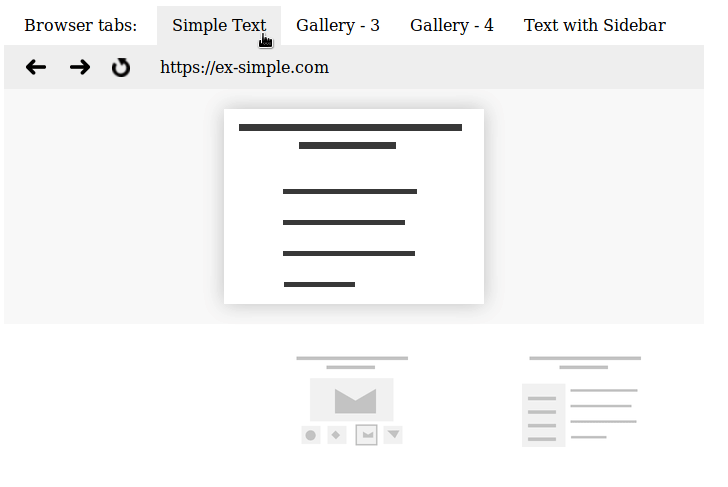
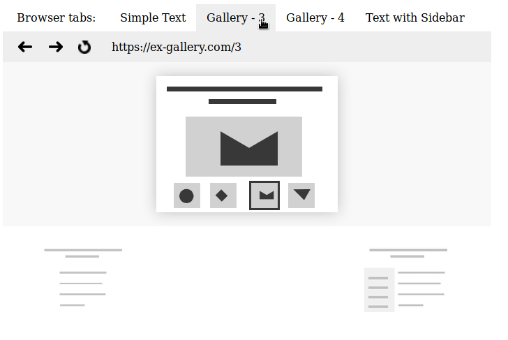
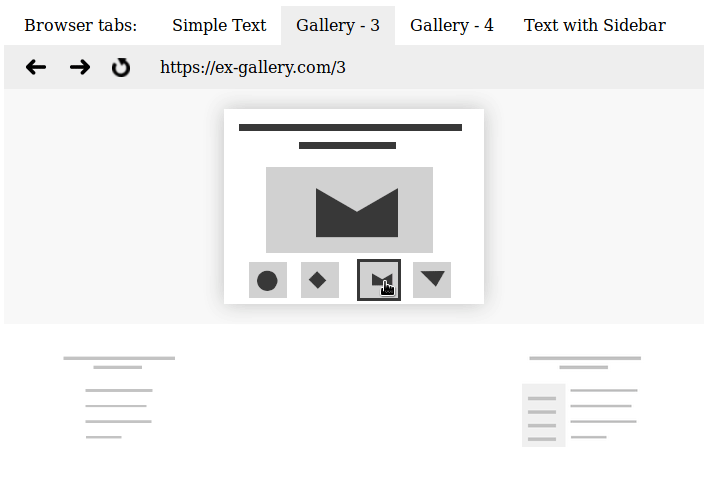

# **Common page instance for multiple tabs - API proposal**

[Document not ready]

In one sentence:  
API enabling the creation single common page instance (view, DOM CSSOM etc.) for multiple opened tabs.  
Multiple tabs are attached to one common page instance.


## **Comparision APIs**

The common page instance API is somewhat analogous to History API.

In the History API, you have a common page instance for multiple history states.  
In the Common page instance API, you have a common page instance for multiple tabs.

| Common page instance API | History API |
|:------:|:------:|
| `event.parallelState` | `window.history.pushState` |
| event `parallelstate` | event `popstate` |
| event `beforeparallelstate` | event `click` on HTML address element |


## **History API**

[Explanation of how it works.](https://flaviocopes.com/history-api/)


## **Common page instance API**

### **Capturing new tab**

Event `beforeparallelstate` - it captures opening a new tab before its opening.  
In the callback function, using the method `event.parallelState`, you can give the tab to the title, icon, stateObject and assign to a common instance.

Listening `beforeparallelstate` applies to each opened a new tab from the same domain in browser window.

``` javascript
window.addEventListener("beforeparallelstate", (event)=>{
   if (isParallelUrl(event.openedUrl)) {
             
      const title = "Parallel tab";
      const icon = getIcon(event.openedUrl);
      const stateObject = { foo: "bar" };
             
      event.parallelState(stateObject, title, icon);
   } else {
      // open normally new tab
   }
});
```

As you can see, in callback, you can decide whether to open it as a common instance tab or open normally new tab.

`isParallelUrl` and `getIcon` are their only own functions created on their own. This is not part of the API.


### **Switching tabs of common page instance**

Clicking a tab of a common page instance, calls `parallelstate` event.

Listening `parallelstate` refers to each switching of cards, the same common page instance.

``` javascript
window.addEventListener("parallelstate", (event)=>{
   const url = event.parallelStateUrl;
   const foo = event.state.foo;
   
   document.querySelector("h1").textContent = foo;
});
```

Clicking the tab switches the common page view,  for that tab and.

Ustawiony nasłuch


### Other APIs

Przepoczwarzenie strony samodzielnej w kartę wspólnej instancji strony.  
Instancja jest jedna na okno przeglądarki, ale czy jest możliwe wiele wspólnych instancji tej samej domeny, dla jednego okna przeglądarki? 

## **Example**

### **Jak jest teraz**

(...)


### **Jak będzie z API**

[Live Demo](index.html)

Na przykładzie są `cztery` karty i tylko `trzy` strony.  
Druga i trzecia karta odnosi się do tej samej, wspólnej strony.  
Przełączenie z karty "Simple Text" na "Gallery 3" powoduje przełączenie widoku.  



Przełączenie z "Gallery 3" na "Gallery 4" nie powoduje przełączenia widoku.  
Jedyne co się dzieje, to odpalenie wewnętrznego skryptu w drugiej stronie, który podmienia obrazek i przesuwa obramowanie miniaturki.  


Są to jakby karty wewnętrzne wspólnej instancji strony, tyle że umiejscowione na pasku kart przeglądarki.

Skrypt wewnątrz strony jest ten sam, co przy przełączaniu między miniaturkami galerii.  


## **Benefits**

* Pozbycie się duplikowania strony w wielu kartach(?)


## **Additional API**

## **Problems, doubts, explanations**

* The names `parallelstate`, `beforeparallelstate` are debatable.
